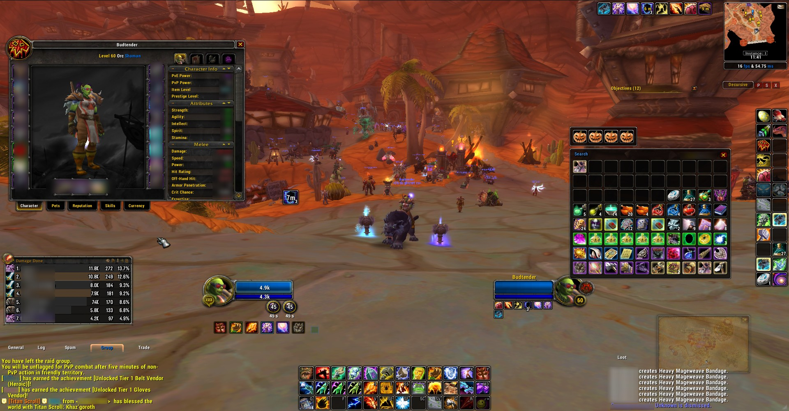
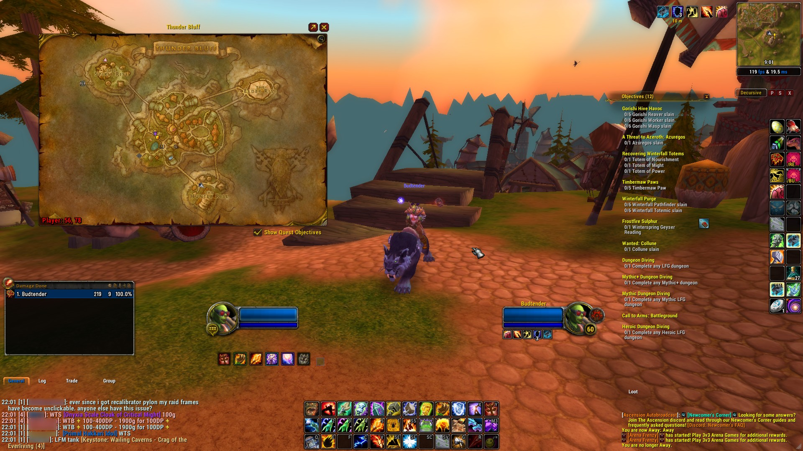
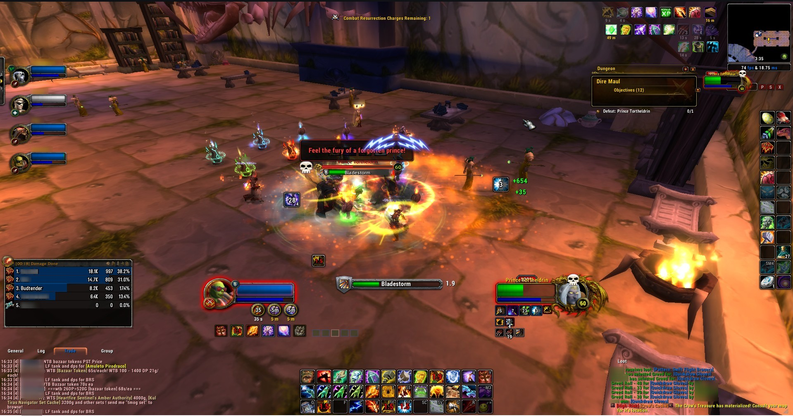
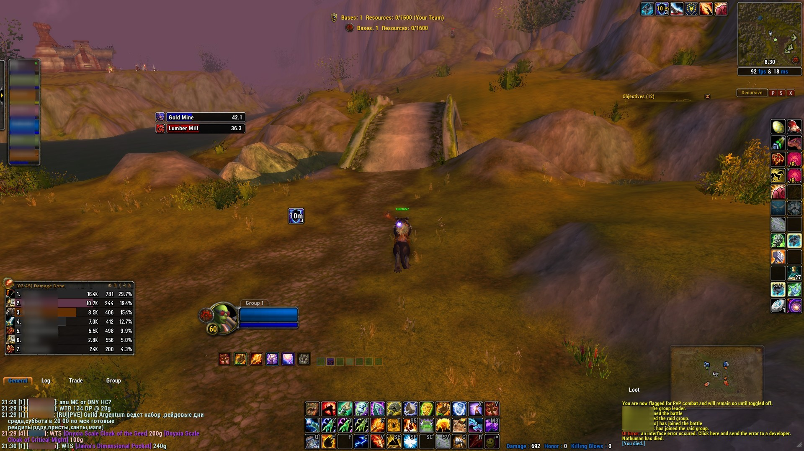
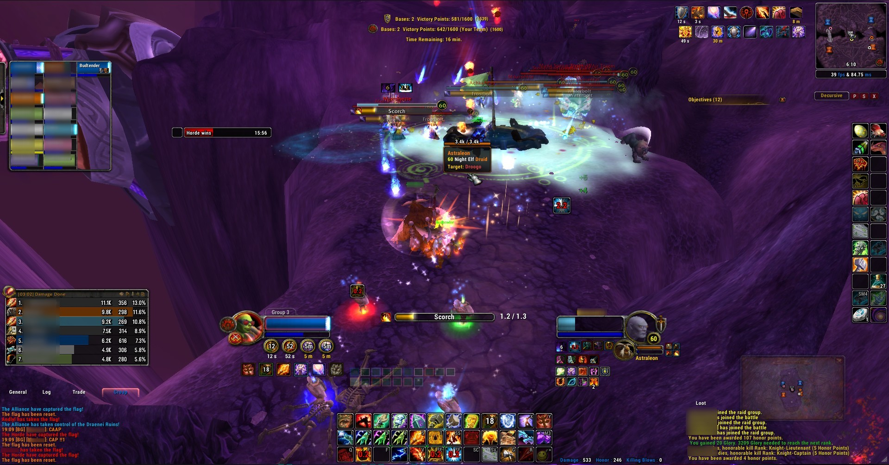

# budsUI

<div align="center">
  
  
  ### Modern UI for World of Warcraft 3.3.5 (WotLK)
  
  [](https://github.com/Budtender3000/budsUI/releases)
  [](https://ascension.gg)
  [](LICENSE)
  
  **Specially developed for [Ascension.gg](https://ascension.gg) Classless Server**
</div>

---

## 🎮 What is budsUI?

budsUI is a complete UI replacement for World of Warcraft 3.3.5, replacing the outdated Blizzard interface with a modern, customizable design. With over 100 configuration options, you can style your interface exactly the way you want.

---

## 📸 Screenshots

<div align="center">
  
  
  
  
  
  
  
</div>

---
### ✨ Main Features

- 🎯 **Action Bars** - 5 customizable bars with cooldown tracking and range display
- 👤 **Unit Frames** - Modern player, target, and party frames
- 💬 **Chat System** - Enhanced chat with URL recognition and spam filter
- 🗺️ **Minimap** - Compact minimap with button collector and farm mode
- 🎒 **Bags** - Organized bags with item quality glow
- 💡 **Tooltips** - Enhanced tooltips with item level, spell IDs, and more
- ⚡ **Automation** - Auto-repair, auto-invite, auto-release, and much more
- 🔔 **Announcements** - Interrupt, sapped, and pull countdown messages
- 🎨 **Skins** - Support for DBM, Recount, Skada, WeakAuras

---

## 📦 Installation

### Step 1: Download
- Download the latest version from [Releases](https://github.com/Budtender3000/budsUI/releases)
- Or clone the repository: `git clone https://github.com/Budtender3000/budsUI.git`

### Step 2: Installation
1. Extract the archive
2. Copy the `budsUI` folder to `World of Warcraft/Interface/AddOns/`
3. Restart WoW

### Step 3: Configuration (recommended)
For the best experience, also install **budsUI_Config** for a graphical configuration interface:
- Download: [budsUI_Config](https://github.com/Budtender3000/budsUI_Config) (separate addon)
- Copy to `Interface/AddOns/`

### Step 4: Getting Started
Upon first login, the installation wizard will automatically appear, which:
- Configures optimal UI settings
- Sets up chat windows
- Defines default positions

---

## 🎮 Usage

### Important Commands

```
/buds              - Opens the configuration menu
/moveui            - Enables frame positioning (Drag & Drop)
/moveui reset      - Resets all positions
/rl                - Reload UI (required after changes)
/installui         - Run installation wizard again
/resetui           - Reset all settings
```

### Other Useful Commands

```
/rc                - Ready Check
/align             - Shows positioning grid
/frame             - Frame inspector (shows frame info under cursor)
/boost             - Sets graphics to minimum (performance mode)
/cc                - Clear chat
```

[Complete Command List](TECHNICAL_DOCUMENTATION.md#commands)

---

## ⚙️ Configuration

### Via GUI (recommended)
With **budsUI_Config** installed:
1. Type `/buds` in chat
2. Navigate through the categories
3. Change settings as desired
4. Type `/rl` to apply changes

### Via Lua File
Advanced users can directly edit `budsUI/Config/Settings.lua`.

> ⚠️ **Important:** After every change, the UI must be reloaded with `/rl`!

---

## 🔧 Modules

<details>
<summary><b>Action Bars</b> - Customizable action bars</summary>

- 5 freely positionable bars
- Pet Bar & Shapeshift Bar
- Totem Bar (for Shamans)
- Range coloring (red = out of range)
- Cooldown text on buttons
- Split bar layout available

</details>

<details>
<summary><b>Unit Frames</b> - Player and group frames</summary>

> ⚠️ Disabled by default! Enable in settings.

- Player, Target, Focus, Pet
- Party & Arena frames
- Castbars with delay display
- Smooth Health/Power bars
- Aura display

</details>

<details>
<summary><b>Chat</b> - Enhanced chat system</summary>

- Restyled chat frames
- URL recognition and copy function
- Chat copy function (`/copychat`)
- Spam filter
- Whisper sounds
- `/tt` command (Tell-to-Target)

</details>

<details>
<summary><b>Minimap</b> - Compact minimap</summary>

- Modern design
- Button collector (all minimap buttons in one dropdown)
- Farm mode (enlarged minimap)
- Right-click menu
- "Who pinged?" display
- **Action Bar Lock** - Special button ("L"/"U") to toggle bar edit mode

</details>

<details>
<summary><b>Tooltips</b> - Enhanced tooltips</summary>

- Item level display
- Spell IDs
- Item count (amount in inventory)
- Achievement progress
- Talent specialization
- PvP rating
- Instance lock info

</details>

<details>
<summary><b>Automation</b> - Quality-of-life features</summary>

- Auto-invite (Keyword: "inv")
- Auto-release on death
- Auto-repair (uses Guild Bank if available)
- Auto-sell gray items
- Auto-decline duels
- Auto-screenshots for achievements
- Combat logging

</details>

<details>
<summary><b>Announcements</b> - Automatic chat messages</summary>

- Interrupt announcements
- "I'm sapped" message
- Pull countdown
- Feast & Portal alerts
- Bad gear warning

</details>

<details>
<summary><b>Class Modules</b> - Class-specific features</summary>

- **Shaman:** Maelstrom Weapon stack counter with animations
- **Hunter:** Hunter utilities

> 💡 Due to Ascension's classless system, all modules load for all classes.

</details>

[Complete Module Documentation](TECHNICAL_DOCUMENTATION.md#modules)

---

## ⚠️ Known Limitations

- **Unit Frames are disabled by default** - Must be manually enabled in settings
- **Settings require UI reload** - No real-time changes possible
- **Minimum screen width: 1200px** - Addon disables itself at smaller resolutions
- **Ascension.gg specific** - Some features are tailored for Ascension (e.g., Maelstrom Weapon spell ID)

---

## 🐛 Report Issues

Found a bug? [Create an issue](https://github.com/Budtender3000/budsUI/issues) with:
- Description of the problem
- Steps to reproduce
- Screenshots (if relevant)
- Lua errors (enable with `/luaerror on`)

---

## 🤝 Contributing

Contributions are welcome! 

1. Fork the repository
2. Create a feature branch (`git checkout -b feature/AmazingFeature`)
3. Commit your changes (`git commit -m 'Add some AmazingFeature'`)
4. Push to the branch (`git push origin feature/AmazingFeature`)
5. Open a pull request

For technical details, see [TECHNICAL_DOCUMENTATION.md](TECHNICAL_DOCUMENTATION.md)

---

## 📚 Documentation

- **[TECHNICAL_DOCUMENTATION.md](TECHNICAL_DOCUMENTATION.md)** - Full technical documentation for developers
- **[CHANGELOG.md](CHANGELOG.md)** - Version history and changes
- **[INTERVIEW_NOTES.md](INTERVIEW_NOTES.md)** - Detailed code analysis

---

## 💖 Credits & License

### Based on
- **[KkthnxUI](https://github.com/kkthnx-wow/KkthnxUI)** by Josh "Kkthnx" Russell
- **[ShestakUI](https://github.com/Shestak/ShestakUI)** by Shestak
- **[DuffedUI](aka hank & liquidbase)** 

### Author
- **[Budtender3000](https://github.com/Budtender3000)** - Author: Budtender3000 with Buds

### Translation
- **Buds** - Translation and maintenance

### License
This project is licensed under the [MIT License](LICENSE).

See also: [Licenses of used libraries](budsUI/Licenses/)

---

<div align="center">
  
  **Have fun with budsUI! 🎮**
  
  [⭐ Star the project](https://github.com/Budtender3000/budsUI) • [🐛 Report a bug](https://github.com/Budtender3000/budsUI/issues) • [💬 Discord](https://ascension.gg)
  
</div>
